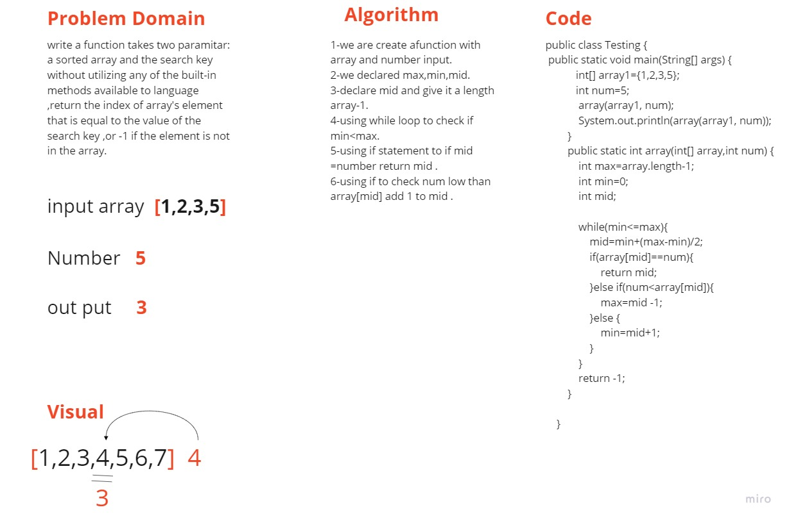

## array-binary-search
# write a function takes two paramitar:
a sorted array and the search key without utilizing any of the built-in
methods available to language ,return the index of array's element that is equal to the value of the search key ,or -1 if the element is not in the array.
# we are create afunction with array and number input.declared max,min,mid.declare mid and give it a length array-1.using while loop to check if min<max.using if statement to if mid =number return mid .using if to check num low than array[mid] add 1 to mid .

## Whiteboard Process

