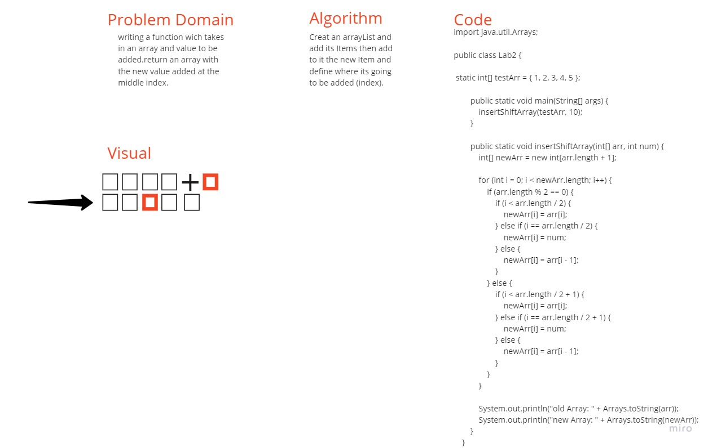

# Insert to Middle of an Array
## writing a function wich takes
## in an array and value to be added.return an array with the new value added at the middle index.

## Creat an arrayList and add its Items then add to it the new Item and define where its going to be added (index).

## Whiteboard Process
