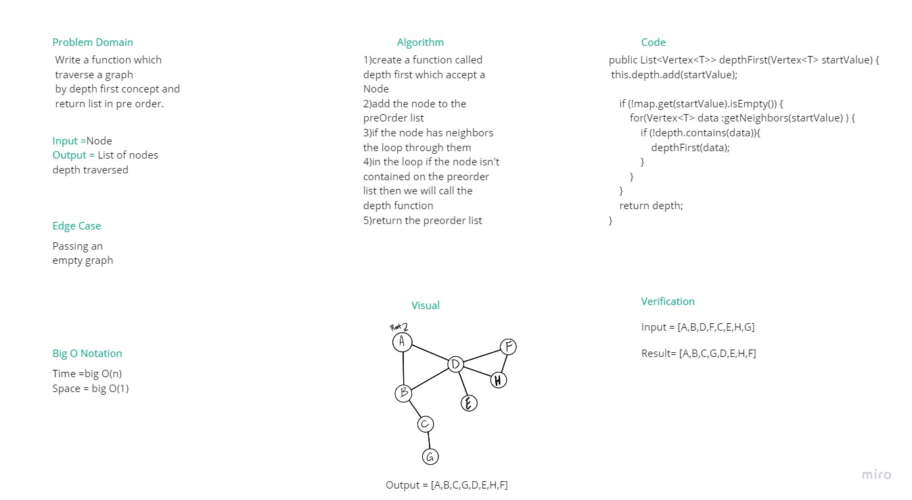
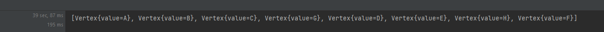

# Challenge Summary

- In this challenge I wrote a method called depthFirst() which takes a starting node, and returns a list of nodes in depth first (pre-order) traversal.

## Whiteboard Process

## Approach & Efficiency
Time Complexity : BigO(n) because I haven't a nested loop 

Space Complexity: BigO(1) because Iam don't creat a list
## Solution

