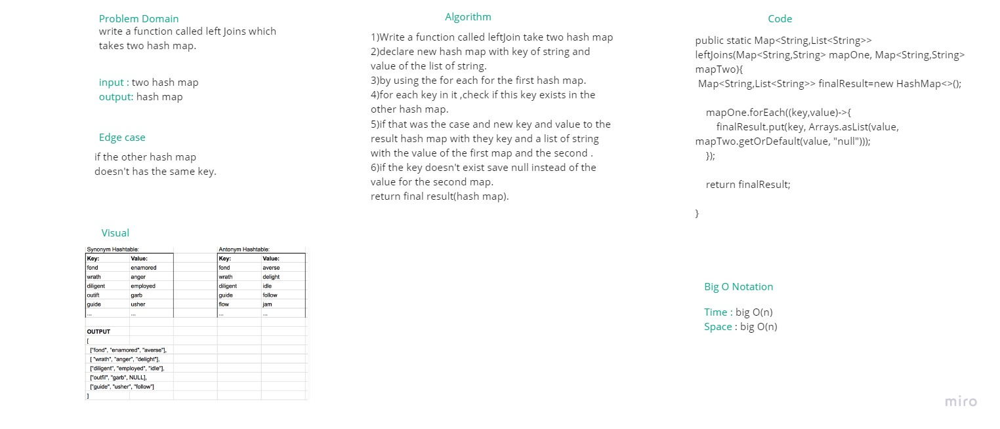

# Hashmap LEFT JOIN

- In this challenge, the inputs are two HashMaps with String key/value pairs. The method is required to perform a LEFT JOIN and return a data structure containing the results. I chose to return another HashMap which has String keys, and a list of String values.

## Challenge

- A LEFT JOIN will return all key/values in the left table, and for any key in the right table that also appears in the left table, that right table's value will also be put into the HashMap.

## Approach & Efficiency

Time complexity : BigO(n)

Space complexity: BigO(n)

## Solution

