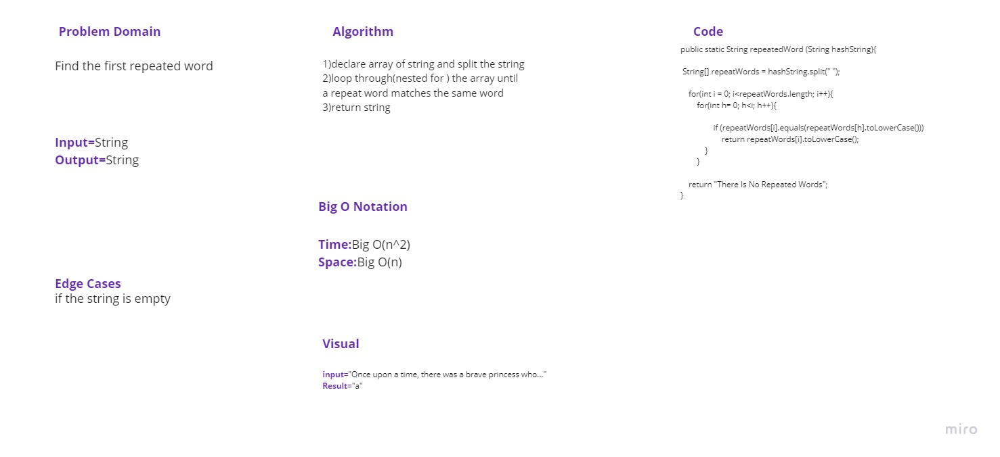
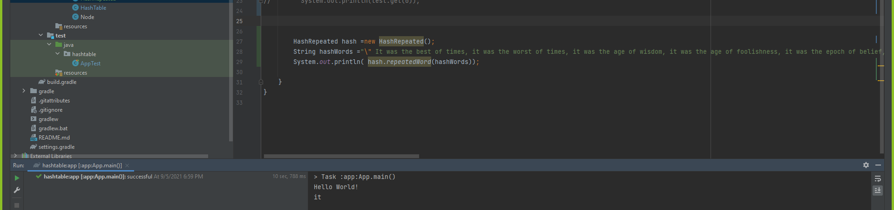

# Challenge Summary

In this challenge, the input is a  String. It could be something like a paragraph , larger. The challenge is to return the first word which occurs in the string more than once.

## Whiteboard Process

## Approach & Efficiency
Time:Big O(n^2)
Space:Big O(n)

## Solution

