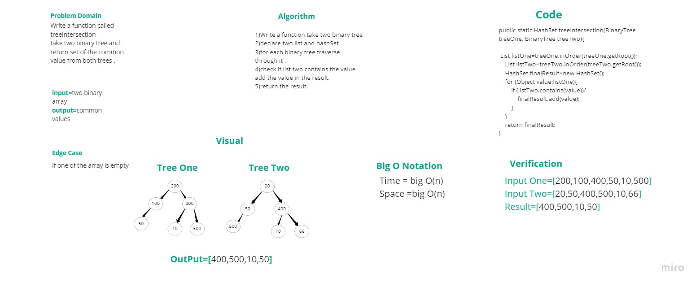
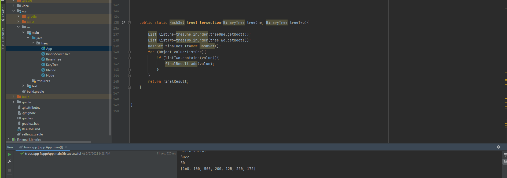

# Challenge Summary
In this challenge, the inputs are two BinaryTrees. The method is required to return a Set of values that appear in both trees.

## Whiteboard Process

## Approach & Efficiency
Time complexity: BigO(n); Because I used the foreach 

Space Complexity : BigO(n); Because I created the lists

## Solution

