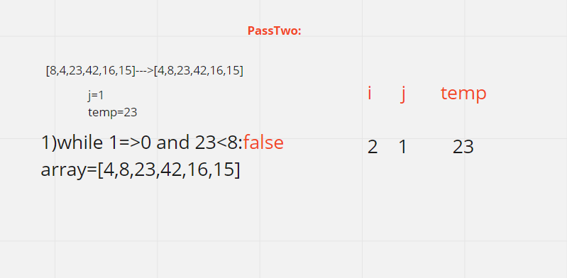

# Insertion sort

Insertion sort is a simple sorting algorithm that builds the final sorted array (or list) one item at a time. It is much less efficient on large lists than more advanced algorithms such as quicksort, heapsort, or merge sort.

# Pseudocode

```
   InsertionSort(int[] arr)

    FOR i = 1 to arr.length

      int j <-- i - 1
      int temp <-- arr[i]

      WHILE j >= 0 AND temp < arr[j]
        arr[j + 1] <-- arr[j]
        j <-- j - 1

      arr[j + 1] <-- temp

```

# Trace

Sample Array: [8,4,23,42,16,15]

## Pass 1:

- In the first pass through, we will find if there is a smaller number in the array than the current number at index[0], and find this smaller number at index [1]; so the smaller number will be swipped with index[0].

when i=1


first

# Pass 2:
- in the second pass, we will find if there is a smaller number than the current index[1], and since there is no smaller it will swipped itself and the array will stay the same.

when i=2


second

## Pass 3:

- now we will find the minimum number after the current index[2] which is at index[5], so it will be swipped with index[2].

when i=3


third

## Pass 4:
- now we will find the minimum number after the current index[3] which is at index[4], so it will be swipped with index[3].

when i=4


fourth

## Pass 5:
- now we will find the minimum number after the current index[4] which is at index[5], so it will be swipped with index[4].

when i=5


fifth

## pass 6 :

- now this is the last index so it is the largest number, so it will be swipped with inself and there will be no new changes.


# Efficency

+ Time: O(n^2)
+ Space: O(1)
