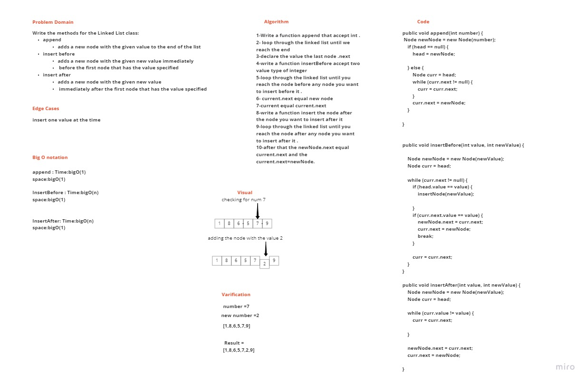

# Challenge Summary
add three function or method (append ,insertBefore,insertAfter)
append : add a node to the end of the linked list
insertBefore : insert a node before a node located i the middle or the first of a linked list
insertAfter :  insert after a node in the middle or last of the linked list

## Approach & Efficiency
append :Time : 
big O(1).
space: big O(1).
insertBefore and After
Time : big O(n).
space: big O(1).

## Whiteboard Process

## Solution
append :  //Can successfully add a node to the end of the linked list

        linkedTest.append(8);
        assertEquals("{ 4 } -> { 3 } -> { 2 } -> { 5 } -> { 2 } -> { 5 } -> { 2 } -> { 5 } -> { 5 } -> { 8 } -> NULL",linkedTest.toString());

insertBefore:
        //Can successfully insert a node before a node located i the middle of a linked list

        linkedTest.insertBefore(5,20);
        assertEquals("{ 4 } -> { 3 } -> { 2 } -> { 20 } -> { 5 } -> { 2 } -> { 5 } -> { 2 } -> { 5 } -> { 5 } -> { 8 } -> { 9 } -> { 10 } -> NULL",linkedTest.toString());

       //Can successfully insert a node before the first node of a linked list

        linkedTest.insertBefore(4,19);
        assertEquals("{ 19 } -> { 4 } -> { 3 } -> { 2 } -> { 20 } -> { 5 } -> { 2 } -> { 5 } -> { 2 } -> { 5 } -> { 5 } -> { 8 } -> { 9 } -> { 10 } -> NULL",linkedTest.toString());

    
    insertAfter: //Can successfully insert after a node in the middle of the linked list

        linkedTest.insertAfter(20,15);
        assertEquals("{ 19 } -> { 4 } -> { 3 } -> { 2 } -> { 20 } -> { 15 } -> { 5 } -> { 2 } -> { 5 } -> { 2 } -> { 5 } -> { 5 } -> { 8 } -> { 9 } -> { 10 } -> NULL",linkedTest.toString());

        //Can successfully insert a node after the last node of the linked list

        linkedTest.insertAfter(10,14);
        assertEquals("{ 19 } -> { 4 } -> { 3 } -> { 2 } -> { 20 } -> { 15 } -> { 5 } -> { 2 } -> { 5 } -> { 2 } -> { 5 } -> { 5 } -> { 8 } -> { 9 } -> { 10 } -> { 14 } -> NULL",linkedTest.toString());
