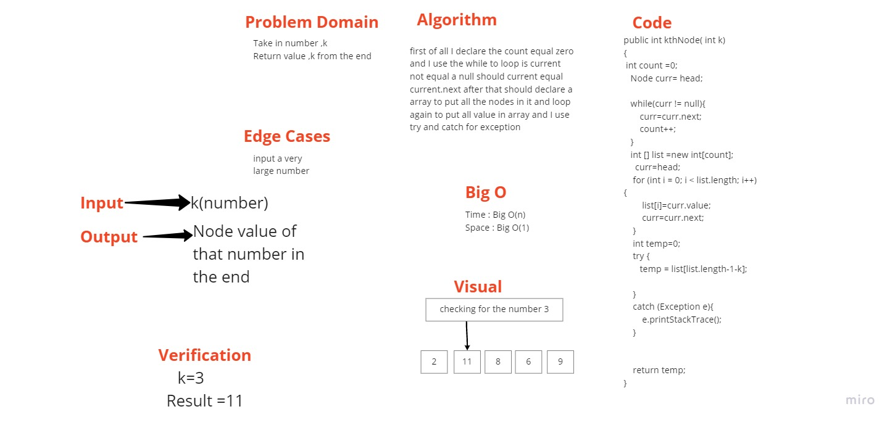

 ## Challenge Summary

Using this method you can insert the index, and it will return the value within that index or error messege of the index is out of the range.

## Whiteboard Process

## Approach & Efficiency
time : Big o(n)
space : Big O(n)

## Solution

 //Where k is greater than the length of the linked list
        assertEquals(19,linkedTest.kthNode(20));

        //Where k and the length of the list are the sam
          assertEquals(19,linkedTest.kthNode(16));

        //Where k is not a positive integer
          assertEquals(19,linkedTest.kthNode(-15));

        //Where the linked list is of a size 1
          LinkedList newTest = new LinkedList();
          newTest.append(6);
          assertEquals(6,newTest.kthNode(0));

        //Happy Path where k is not at the end, but somewhere in the middle of the linked list
        assertEquals(8,linkedTest.kthNode(3));

