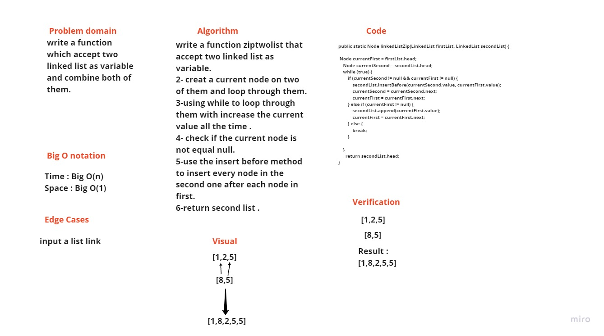

# Challenge Summary
writing a function that accept two linked lists as a parameters, and retern a linked list which have both of them combined.

## Whiteboard Process

## Approach & Efficiency
time big O = O(n) because i used a while loop to iterate through the linked lists. space big O = O(1) because i didnt use any type of arrays

## Solution
     // code challenge 8 linked-list-zip:

        LinkedList testOne = new LinkedList();
        testOne.append(1);

        LinkedList testTwo = new LinkedList();
        testTwo.append(8);
        testTwo.append(5);

        linkedListZip(testOne, testTwo);

        assertEquals("{ 1 } -> { 8 } -> { 5 } -> NULL",testTwo.toString());

        LinkedList test1= new LinkedList();
        test1.append(1);

        LinkedList test2= new LinkedList();
        test2.append(8);

        linkedListZip(test1, test2);

        assertEquals("{ 8 } -> NULL",test2.toString());

        LinkedList firstTest = new LinkedList();

        LinkedList secondTest = new LinkedList();
        secondTest.append(8);
        secondTest.append(5);

        linkedListZip(firstTest, secondTest);

        assertEquals("{ 8 } -> { 5 } -> NULL",secondTest.toString());
