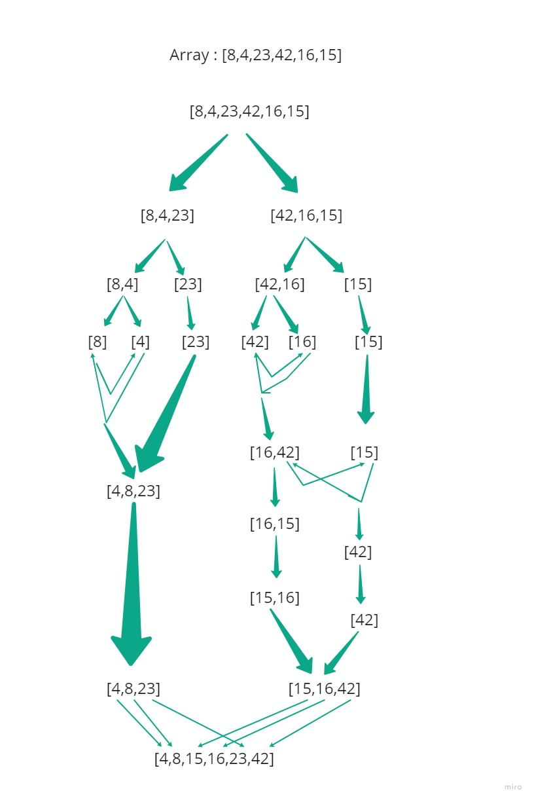

# Merge Sort

Sorting an array by dividing it to two half each time until it is sorted from the smallest to the largest number and then merge it.

### Pseudocode

```
ALGORITHM Mergesort(arr)
    DECLARE n <-- arr.length

    if n > 1
      DECLARE mid <-- n/2
      DECLARE left <-- arr[0...mid]
      DECLARE right <-- arr[mid...n]
      // sort the left side
      Mergesort(left)
      // sort the right side
      Mergesort(right)
      // merge the sorted left and right sides together
      Merge(left, right, arr)

ALGORITHM Merge(left, right, arr)
    DECLARE i <-- 0
    DECLARE j <-- 0
    DECLARE k <-- 0

    while i < left.length && j < right.length
        if left[i] <= right[j]
            arr[k] <-- left[i]
            i <-- i + 1
        else
            arr[k] <-- right[j]
            j <-- j + 1

        k <-- k + 1

    if i = left.length
       set remaining entries in arr to remaining values in right
    else
       set remaining entries in arr to remaining values in left
```

### Trace

```Array: [8,4,23,42,16,15]```

###### Pass1:
in the first pass, the array will be split to two half.

###### Pass 2
the two half will be split again, so we have 4 arrays.

###### Pass 3
the arrays which have more than one element will be split again, so we have 6 arrays.

###### Pass 4
The left side will be sorted.

###### Pass 5
The right side will be sorted

###### Pass 6
after the sorting finish, the arrays will be merged into one array.

###### Pass 7
Final iteration will be the finished merged array.



### Efficiency

Time efficiency: O(n log n)

Space efficiency: O(n log n)