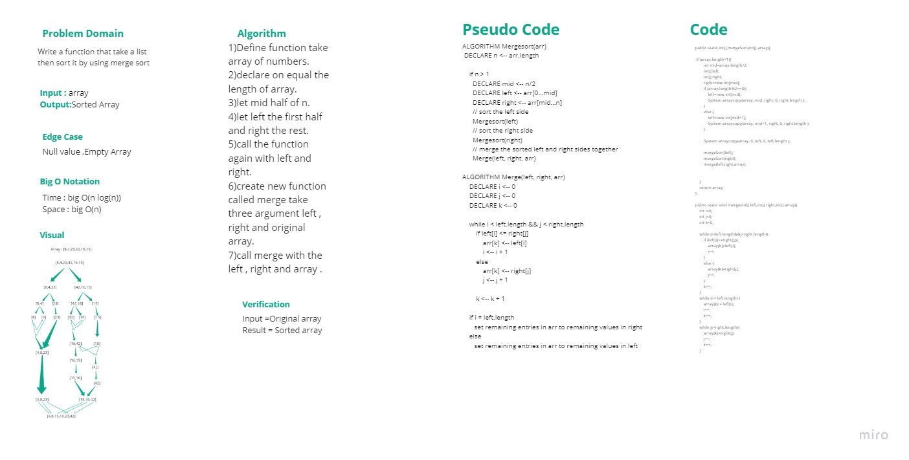
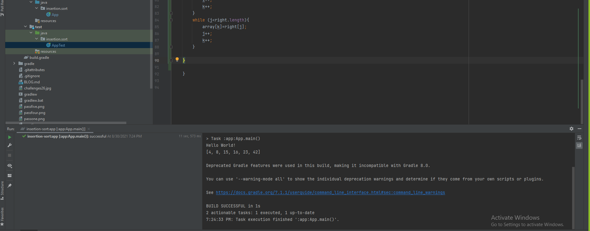

# Challenge Summary

Sorting an array by dividing it to two half each time until it is sorted from the smallest to the largest number and then merge it.

## Whiteboard Process

## Approach & Efficiency

Time : big O(n log(n))

Space : big O(n)

## Solution

