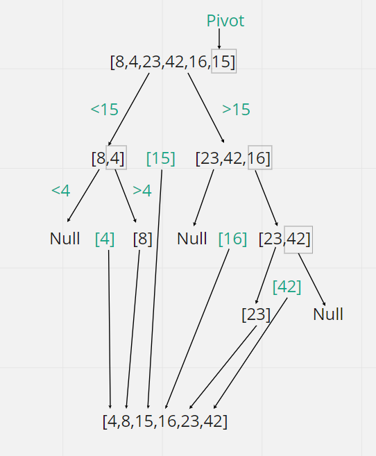

# Quick Sort

- Quick sort is based on the divide-and-conquer approach based on the idea of choosing one element as a pivot element and partitioning the array around it such that: Left side of pivot contains all the elements that are less than the pivot element Right side contains all elements greater than the pivot.

- It reduces the space complexity and removes the use of the auxiliary array that is used in merge sort. Selecting a random pivot in an array results in an improved time complexity in most of the cases. 

***

### Pseudocode

```
ALGORITHM QuickSort(arr, left, right)
    if left < right
        // Partition the array by setting the position of the pivot value
        DEFINE position <-- Partition(arr, left, right)
        // Sort the left
        QuickSort(arr, left, position - 1)
        // Sort the right
        QuickSort(arr, position + 1, right)

ALGORITHM Partition(arr, left, right)
    // set a pivot value as a point of reference
    DEFINE pivot <-- arr[right]
    // create a variable to track the largest index of numbers lower than the defined pivot
    DEFINE low <-- left - 1
    for i <- left to right do
        if arr[i] <= pivot
            low++
            Swap(arr, i, low)

     // place the value of the pivot location in the middle.
     // all numbers smaller than the pivot are on the left, larger on the right.
     Swap(arr, right, low + 1)
    // return the pivot index point
     return low + 1

ALGORITHM Swap(arr, i, low)
    DEFINE temp;
    temp <-- arr[i]
    arr[i] <-- arr[low]
    arr[low] <-- temp
```
***
### Trace

``` Array: [8,4,23,42,16,15]```

##### Pass1:
* The array will be divided into two halves: a half that is less that the pivot, and a half that is larger to the pivot.

##### Pass2: 
* The two arrays again will be divided into two halves; a half that is less than the pivot and a half that is larger than the pivot. 

##### pass3: 
* It will keep dividing the arrays until the whole values sorted from the smallest to the largest.

***



***
### Efficiency

* Time efficiency: O(n^2)

* Space efficiency: O(1)
