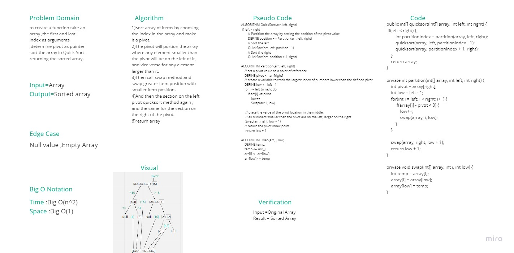

# Challenge Summary
   - Sort array of items by choosing the last index in the array and make it a pivot.

   - the pivot will porition the array where any element smaller than the pivot will be on the left of it , and vice versa for any element larger than it

   - then call swap method and swap greater item position with smaller item position.

   - and then part of pivot on the left will call qucksort method again.

    -also part on the right until all items on left of pivot and on right of pivot are in their correct position.

## Whiteboard Process

## Approach & Efficiency

- Time : Big O(n^2)

- Space : Big O(1)
## Solution
