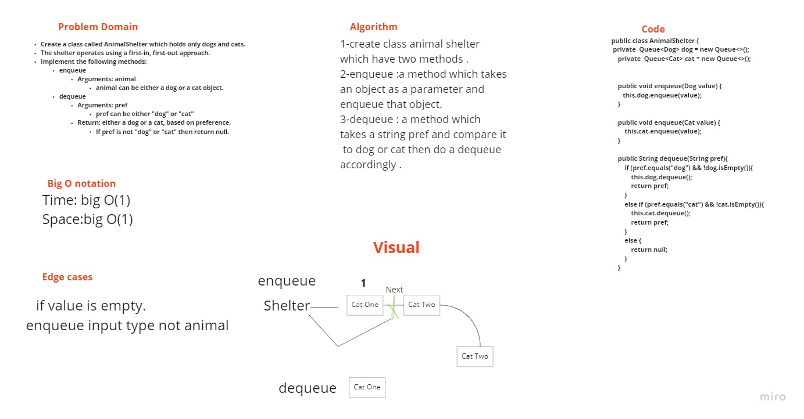
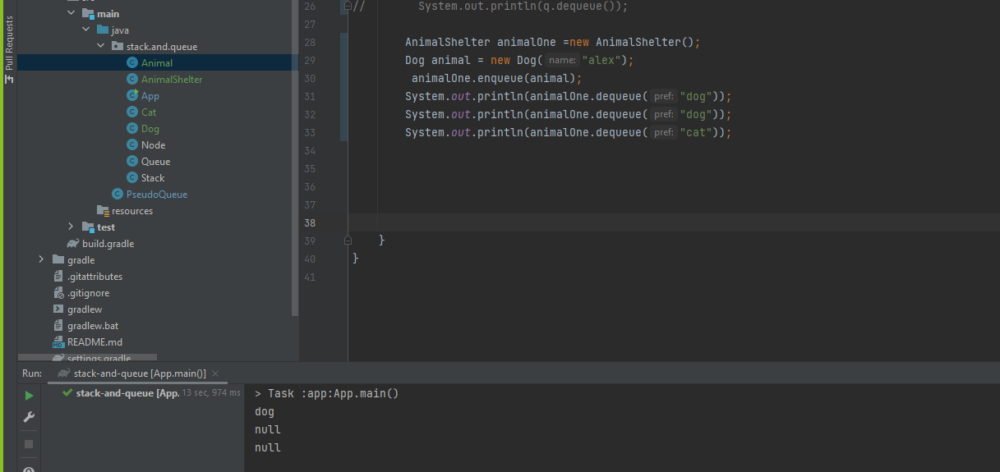

# Challenge Summary
Animal store that has only cats and dogs want to store the new animals in a queue and the first animal to enter the store will be the first to leave.

## Whiteboard Process

## Approach & Efficiency
Time:big O(1)
Space:big O(1)

## Solution

