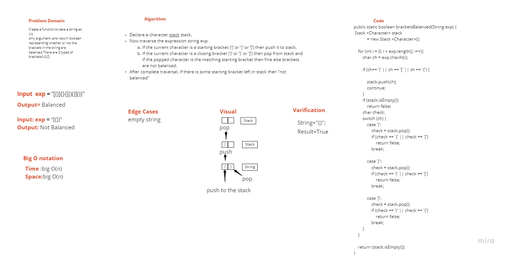
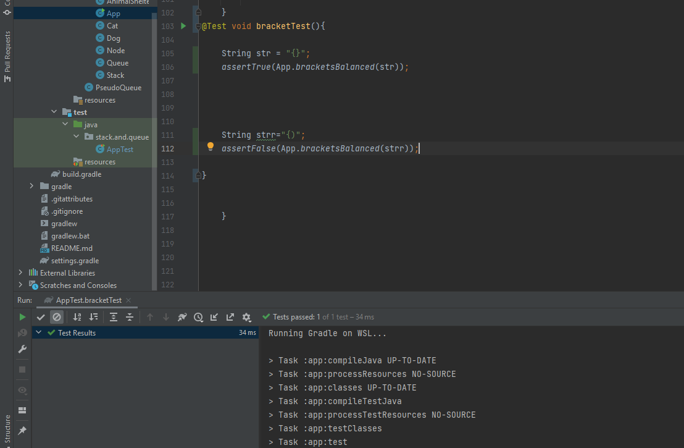

# Challenge Summary
Create a method to take a string as its only argument, and return a boolean representing whether or not the brackets in the string are balanced. There are 3 types of brackets: (), {}, [].

## Whiteboard Process

## Approach & Efficiency
Time:Big O(n)
Space:Big O(n)

## Solution

