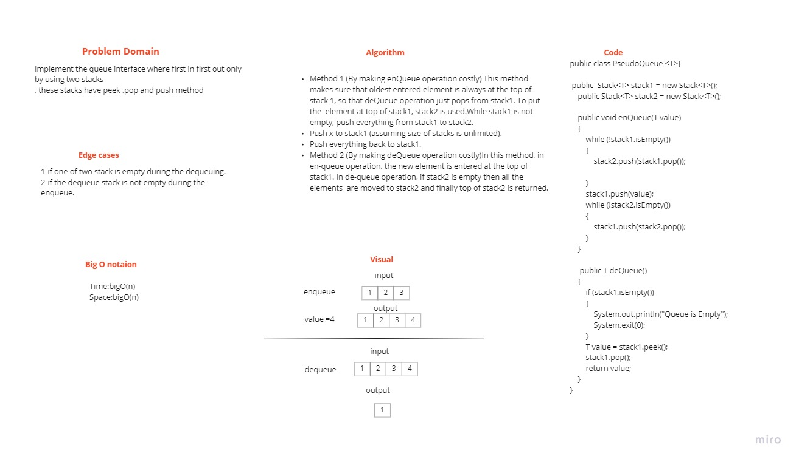

# Challenge Summary
Identify and implement a efficient solution for the PseudoQueue. where you should create a brand new PseudoQueue class that only uses two internal stacks for implementation.

## Whiteboard Process

## Approach & Efficiency
Time:bigO(n)
Space:bigO(n)

