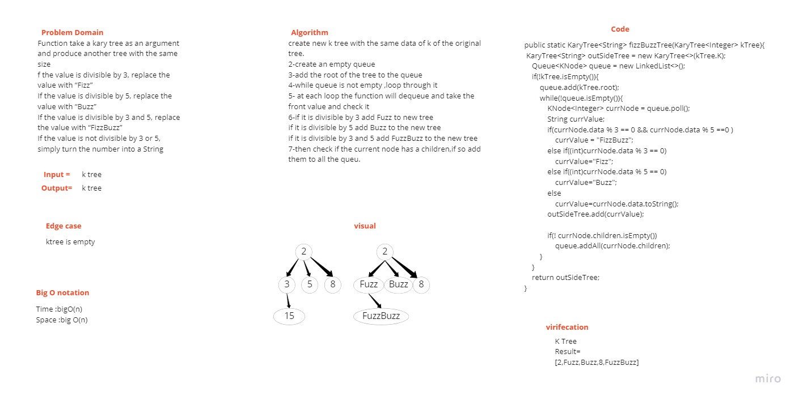
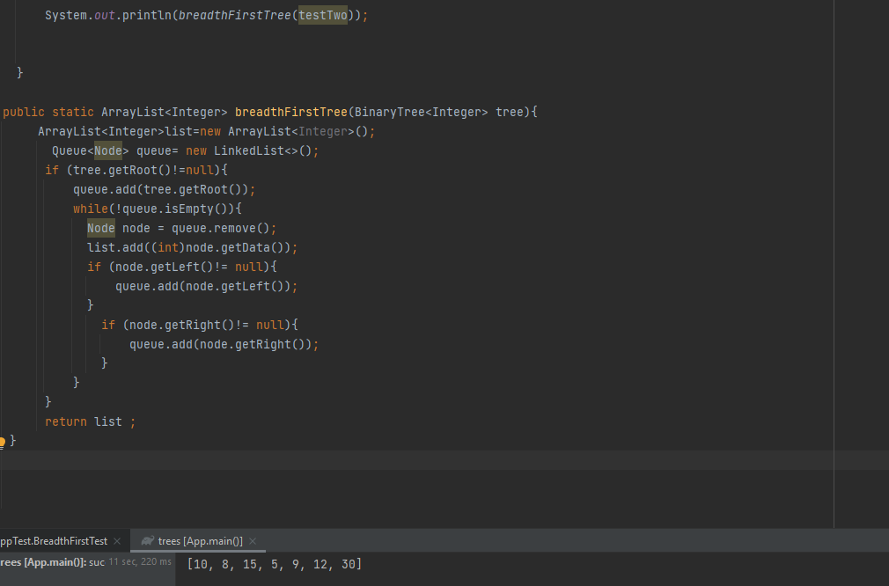

# Challenge Summary
In this challenged I had to take in a K-ary tree as an argument, and then determine weather or not the value of each node is divisible by 3, 5 or both, and change the value of each of the nodes:

If the value is divisible by 3, replace the value with Fizz

If the value is divisible by 5, replace the value with Buzz

If the value is divisible by 3 and 5, replace the value with FizzBuzz

## Whiteboard Process

## Approach & Efficiency
Time :bigO(n)
Space :big O(n)

## Solution
