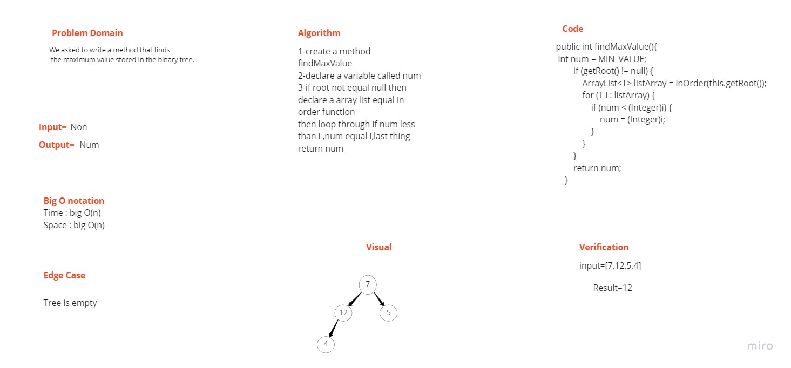
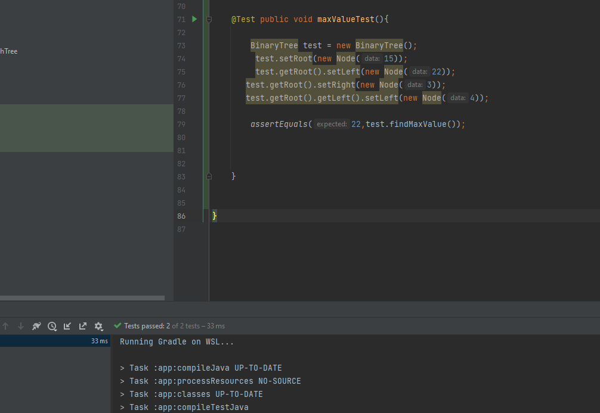

# Challenge Summary
We asked to write a method that finds the maximum value stored in the binary tree.

    Method: findMaxValue()
    Arguments: none
    Returns: num

## Whiteboard Process

## Approach & Efficiency
Time :big O(n)
Space :big O(n)

## Solution

